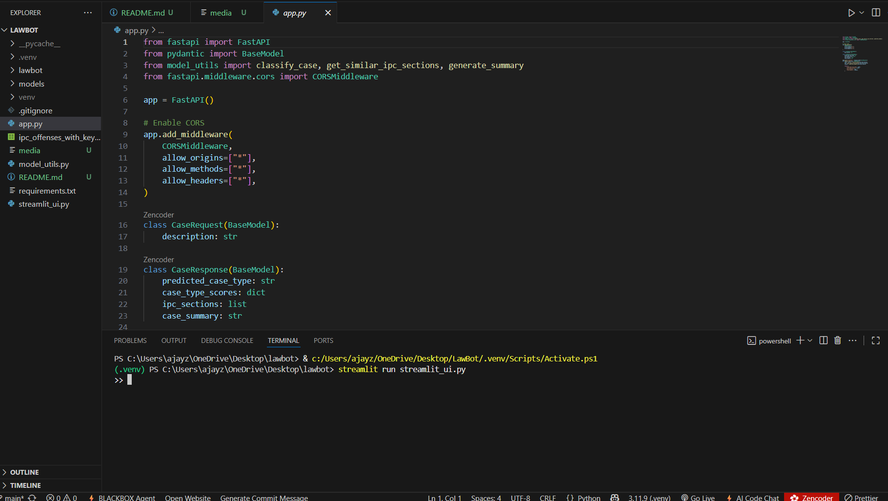
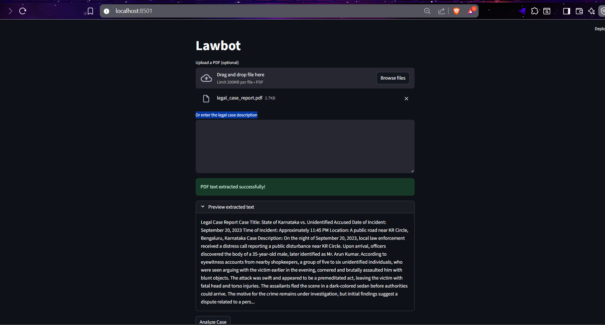
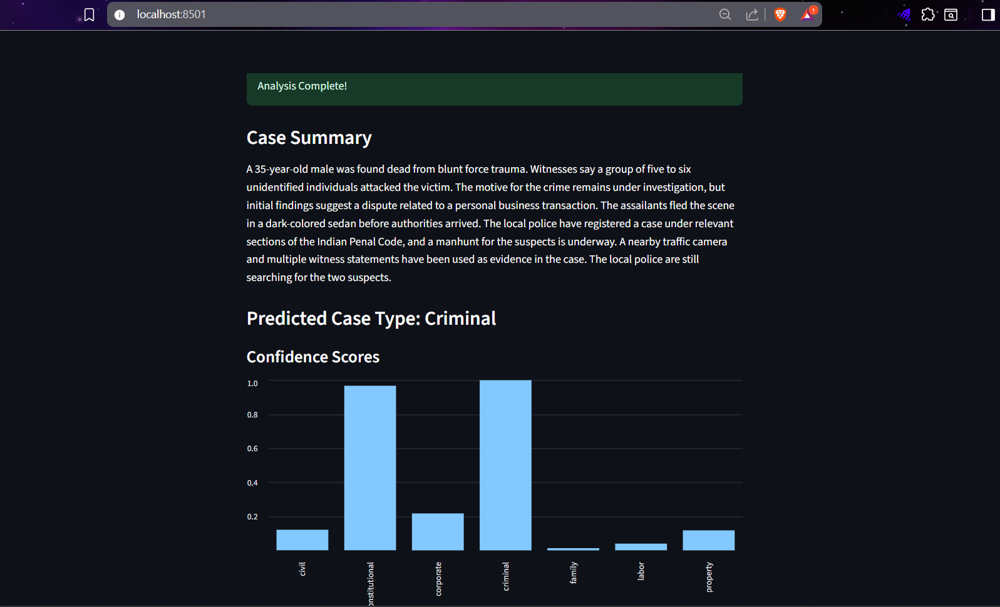
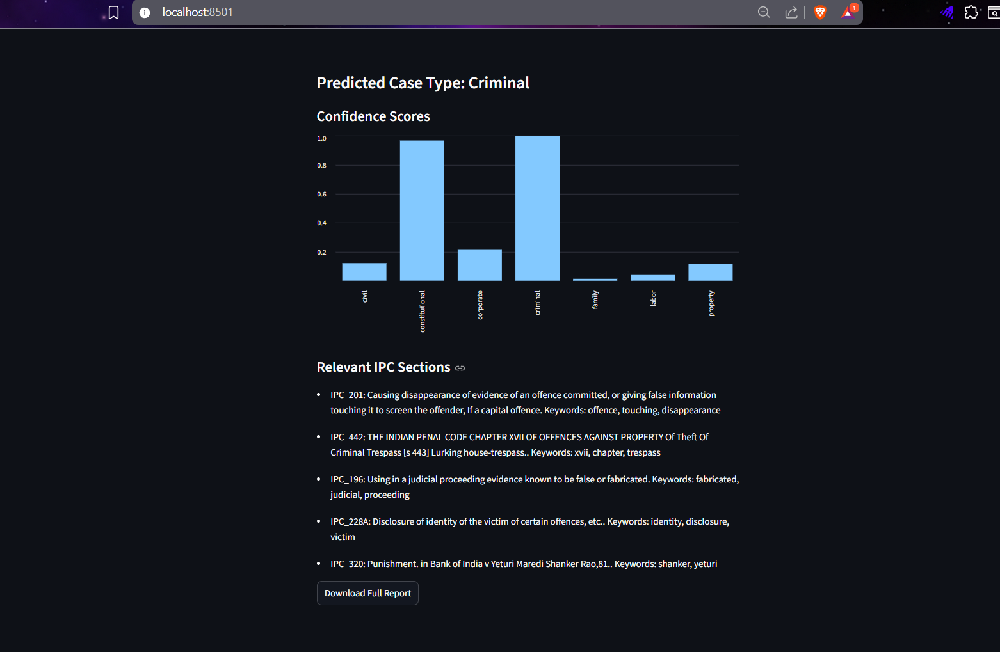
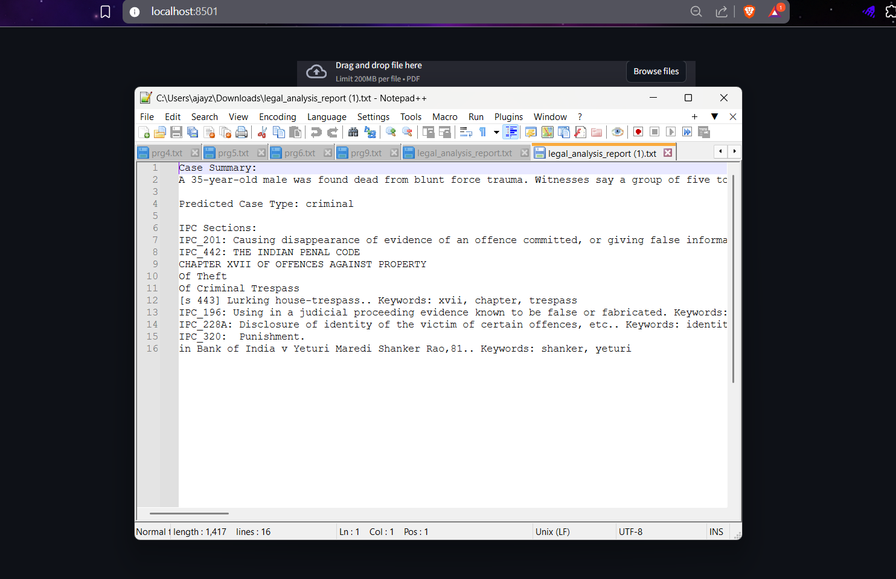

# ⚖️ LawBot: AI-driven Legal Case Analyzer


**LawBot** is an AI-powered tool that helps analyze legal case descriptions.
It predicts the **case type** (e.g., civil, criminal, family, corporate) and recommends relevant **IPC (Indian Penal Code) sections** using advanced NLP models.

---

## 🚀 Features

* 🧠 **Zero-shot classification** of case type using **DeBERTa-v3**
* 📖 Semantic matching with **Sentence Transformers** for IPC section prediction
* 🌐 **FastAPI backend** (`app.py`) for API services
* 💻 **Streamlit frontend** (`streamlit_ui.py`) for interactive use
* 📊 CSV dataset of IPC sections included
* 📥 **Downloadable full report** of analysis

---

## 📂 Project Structure

```
LawBot/
├─ README.md            # Project documentation
├─ app.py               # FastAPI backend
├─ model_utils.py       # ML/NLP utilities
├─ streamlit_ui.py      # Streamlit interface
├─ ipc_offenses_with_keywords_tfidf.csv # IPC dataset
├─ requirements.txt     # Dependencies
├─ models/              # Pretrained model downloads
└─ .venv/               # Virtual environment
```

---

## 🔧 Installation & Setup

Clone the repo:

```bash
git clone https://github.com/keerthana-ki/LawBot.git
cd LawBot
```

Create a virtual environment and activate it:

```bash
python -m venv .venv
# Windows
.venv\Scripts\Activate.ps1
# Linux/Mac
source .venv/bin/activate
```

Install dependencies:

```bash
pip install -r requirements.txt
```

---

## 📌 Usage

### Run Backend (FastAPI)

```bash
python -m uvicorn app:app --reload
```

* Open: [http://127.0.0.1:8000/docs](http://127.0.0.1:8000/docs)

### Run Frontend (Streamlit)

```bash
streamlit run streamlit_ui.py
```

* Open: [http://localhost:8501](http://localhost:8501)

---

## 💡 Example Usage

**Input:**

```
A group of people killed a person late night near KR Circle.
```

**Predicted Output:**

* **Case Type:** Criminal
* **Relevant IPC Sections:**
  * Section 301: Culpable homicide by causing death of person other than person intended
  * Section 308: Attempt to commit culpable homicide
  * Section 303: Murder by a person under Sentence of imprisonment for life

---

## 🛠️ Tech Stack

* **Python**
* **FastAPI** (backend)
* **Streamlit** (frontend)
* **Transformers / HuggingFace**
* **Sentence Transformers**
* **PyTorch**
* **PyMuPDF**, **Pandas**, **scikit-learn**

---

## 📸 Screenshots

### Screenshot 1 – Codebase
This shows a snippet of the project's codebase in VS Code, highlighting the use of **FastAPI** and **Pydantic**.  


### Screenshot 2 – Upload UI
This is the main user interface where users can upload a **PDF** or enter a **case description** for analysis.  


### Screenshot 3 – Case Summary
This shows the **analysis results**, including a predicted case type and confidence scores displayed in a **bar chart**.  


### Screenshot 4 – Relevant IPC Sections
This displays the **detailed analysis**, listing relevant **IPC sections** and associated keywords.  


### Screenshot 5 – Analysis Report
This shows the final generated **analysis report** in a downloadable `.txt` format.  


---

## 🤝 Contributors

* **Keerthana A**
* **Prajwal Arali**
* **Ranjitha N R**

---

## 📜 License

This project is licensed under the **MIT License**.

---

## 📝 Resume-Friendly Description

**LawBot** — AI Legal Case Analyzer that processes legal text or PDFs, generates summaries, classifies case type, recommends IPC sections, and produces downloadable reports. Built with FastAPI, Streamlit, Transformers, and DeBERTa.
